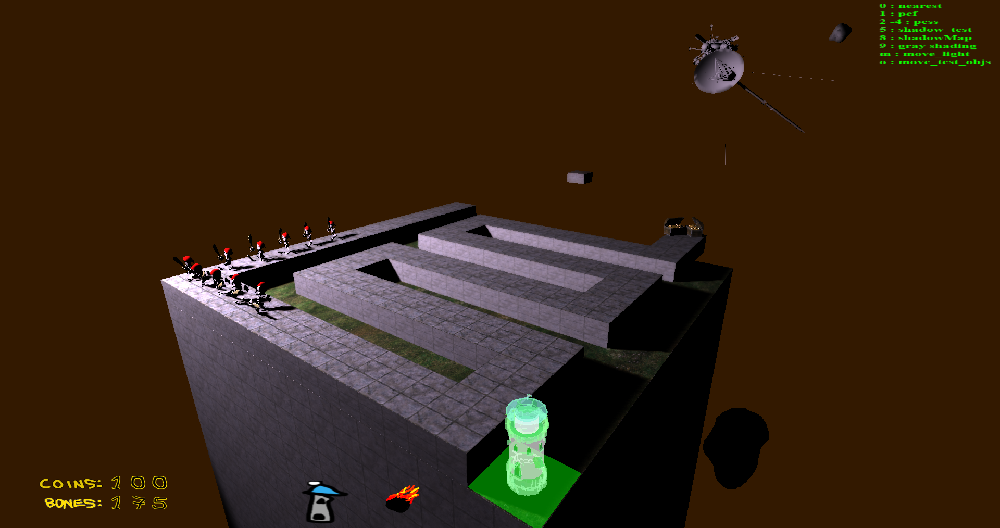
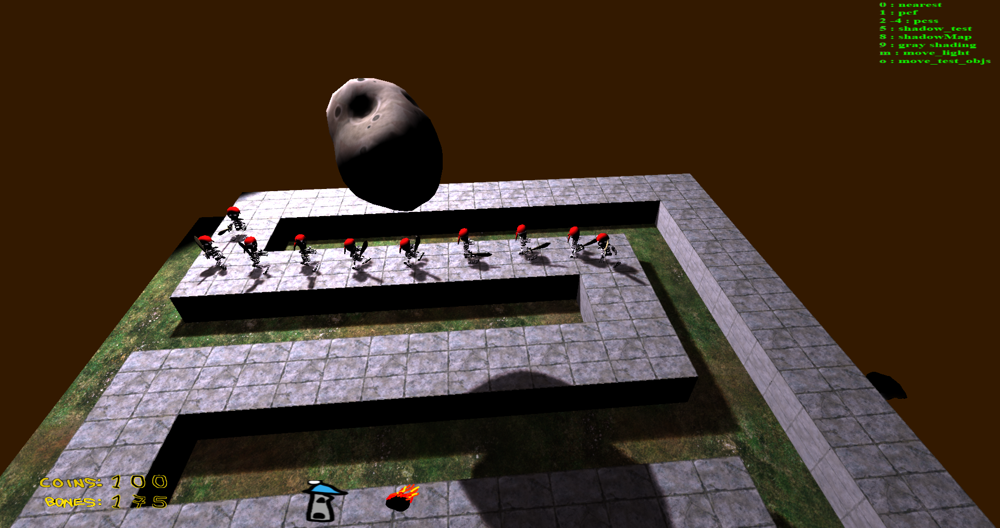
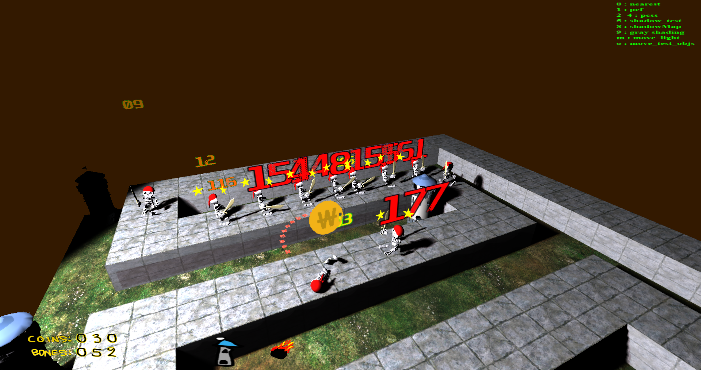
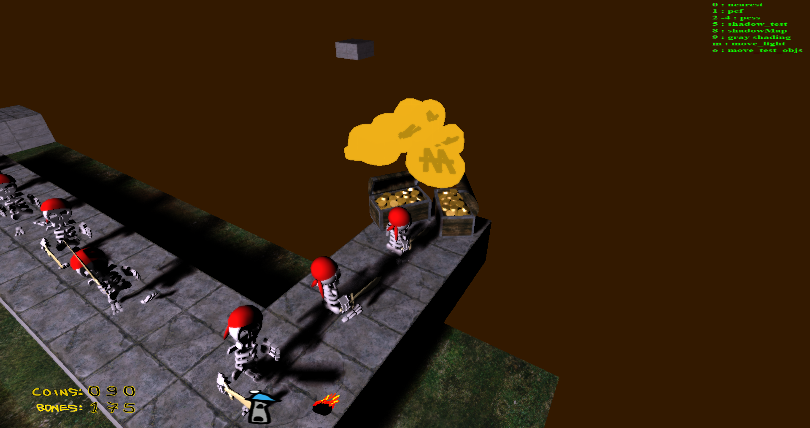

# ABOUT

# Project: 3D Tower Defense Game
- <b>Programming Language</b> : C++
- <b>APIs used</b> : OpenGL, irrKlang lib for audio
- <b>Subject</b> : A 3D Tower Defense game whose enemies are some pirates trying to reach the end of each map and get the Gold! The player tries to stop them pirates by putting defense towers in key-point positions and using 2 extra super powers , the Satelite Super Power or the Meteor one. If the whole gold gets stolen from the treasure chest before the end of the map, the player loses!
- <b>Purpose</b> : University Project.

#

- constructing a Tower

- Using the Meteor Super Power

- The treasure chest at the end of the path

