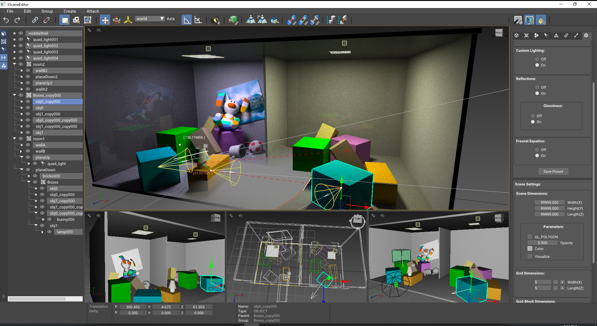
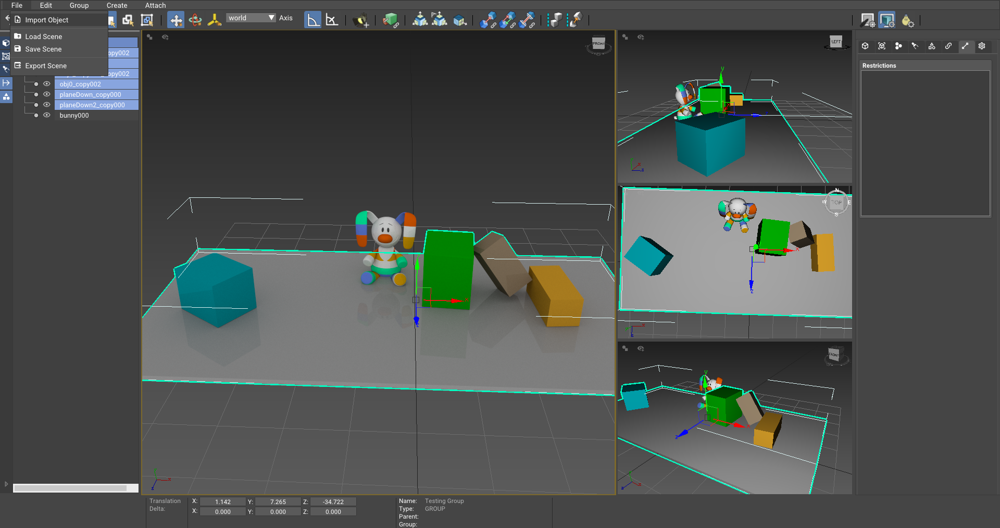
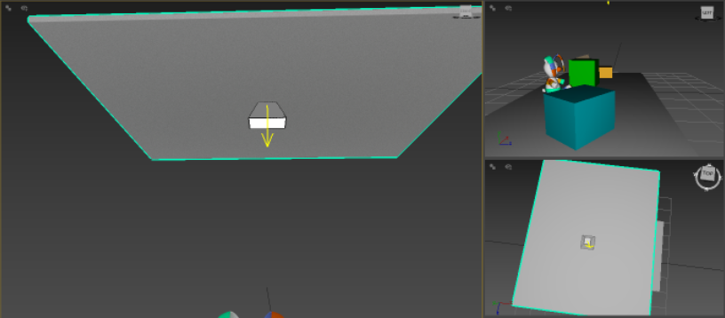
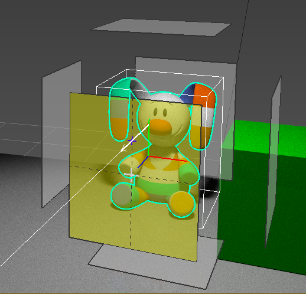
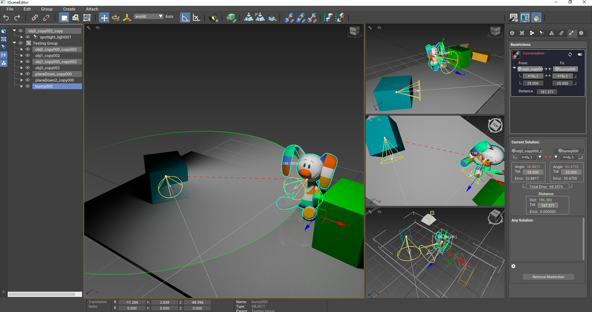
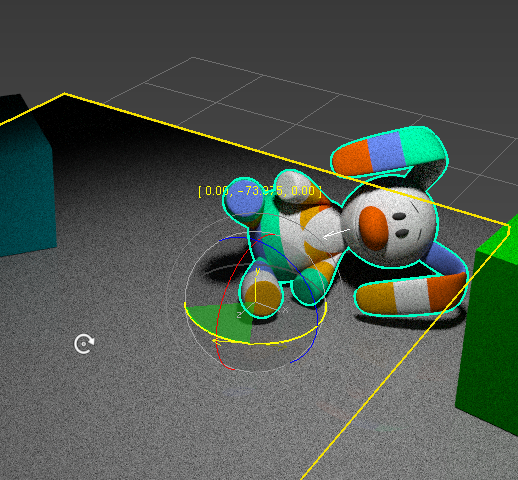

# ABOUT

# Project: Degree Thesis
- <b>Programming Language</b> : C++
- <b>APIs used</b> : Nvidia Optix, OpenGL, DearImGui
- <b>Subject</b> : 3D scene design software, focused mainly on the interior spatial domain and the furniture layout arrangement problem. Supports a variety of object manipulation and relational utilities(essential transformations, parent-child relations, groups, etc.). Most importantly, provides the user with a set of specific spatial,functional and illumination constraints, addressing a more constraint-driven designing process. Lastly, implements a physical based path-tracer rendering pipeline, via the NVidia OptiX API.
- <b>Hardware Dependencies</b> : NVidia OptiX 6.0+ compatible GPU.

#

<b>- Loading some objects into the scene </b>

<b>- Creating a Light Object </b>

<b>- Defining a Facevector </b>

<b>- Defining a Constraint between two objects </b>

<b> Transforming an object </b>

