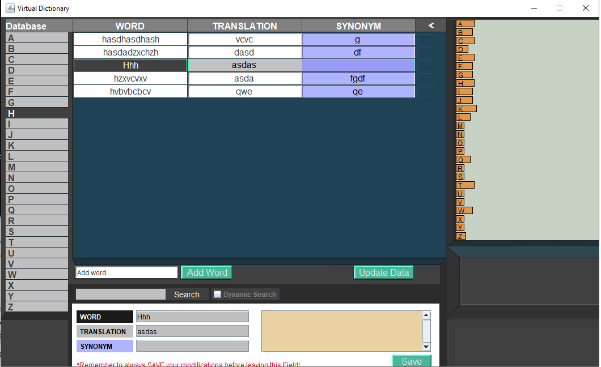

# ABOUT

# Project: Virtual Dictionary
- <b>Programming Language</b> : Java
- <b>APIs used</b> : Swing Package
- <b>Subject</b> : A virtual dictionary for keeping stored words, their synonyms and translations, with whatever notes you want. Supports loading / saving , searching, and viewing some simple statistics.
- <b>Purpose</b> : for fun!

