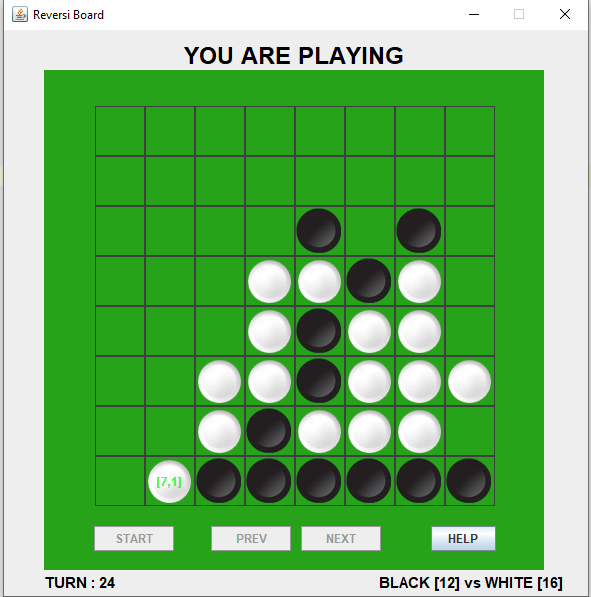

# ABOUT

# Project: Reversi Board Game with AI enemy
- <b>Programming Language</b> : Java
- <b>APIs used</b> : Swing Package
- <b>Subject</b> : An app implementing the Reversi board game. The user plays vs. the computer
at different levels of difficulty. The computer chooses the ‘best’ action each turn  by using a ‘MinMax’ based prediction algorithm. Given higher levels of difficulty, computer traverses deeper the action graph, thus getting better decisions
- <b>Purpose</b> : for fun!

