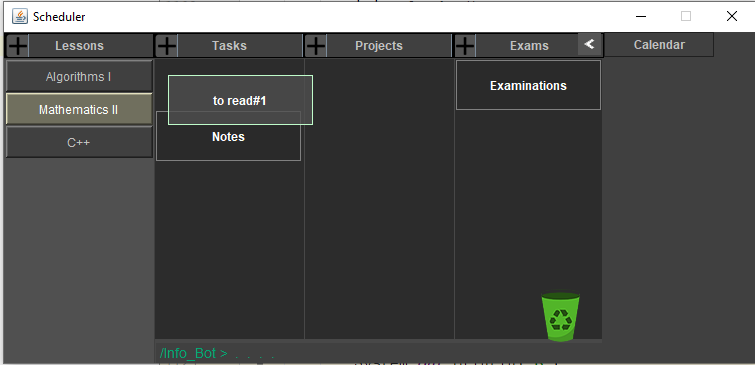

# ABOUT

# Project: Task Scheduler
- <b>Programming Language</b> : Java
- <b>APIs used</b> : Swing Package
- <b>Subject</b> : A Task Scheduler, not finished, responsible for keeping in track your to-do list, notes, exam dates, etc.
- <b>Purpose</b> : for fun!

